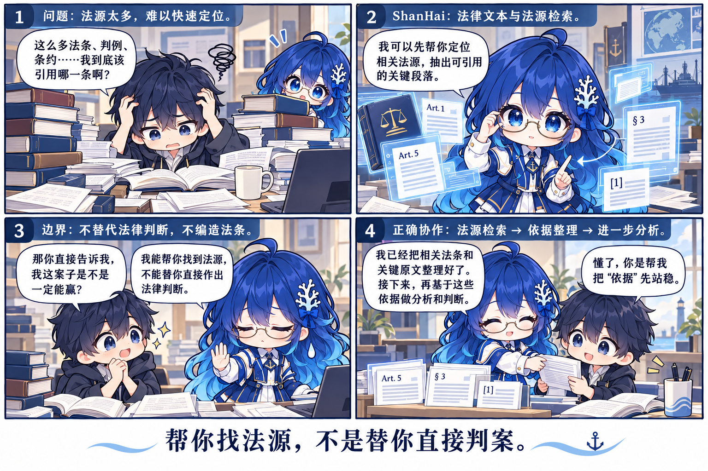

<p align="center">
  
</p>

[English](README.md) | [简体中文](README.zh-CN.md) | [繁體中文](README.zh-TW.md) | [日本語](README.ja.md)

# ShanHai（海珊）

**法律文本证据 Skill**

海珊是一个可以独立使用的开源法律文本证据 Skill，用于法律/文本证据的结构化抽取与引用重建。它读取 UTF-8 法律文本，识别法律结构，产出带有精确字符、字节与行号区间的证据单元；引用可以回溯到原始文本并再次校验；结构问题以可检查的分类结果报出，而不是靠猜测填补。

不做静默推断：没读到就记为损失，位置不唯一就记为歧义，结构有问题就记为一个明确的诊断项。

## 独立使用是受支持的一等用法

海珊**不依赖私有 SeaFlow 基座**即可：

- 单独克隆；
- 单独测试；
- 单独运行；
- 集成到其他软件。

在 SeaFlow 环境中，海珊可以作为官方 Skill / 插件接入；是否接入是可选的，接入逻辑实现在 SeaFlow 一侧，海珊本身不导入 SeaFlow。

> **“作为 SeaFlow Skill” ≠ “必须依赖 SeaFlow 才能运行”。**
>
> 这两件事是分开的：接入 SeaFlow 是一种集成方式，独立运行是另一种方式，二者都受支持。

---

<p align="center">
  
</p>

## 能力范围

下表为 Skill 在运行时声明能力，未列出的能力即未实现。

| 能力 | 支持程度 | 说明 |
| --- | --- | --- |
| 法律文本证据单元 | supported | 每个识别出的“条”产出一个证据单元；另产出“章”的容器单元，以及未识别出条文时的文档级单元 |
| 结构诊断 | supported | `empty_artifact`、`unsupported_structure`、`missing_marker`、`malformed_marker`、`numbering_gap`、`duplicate_marker`、`encoding_failure`，各自独立、互不合并 |
| 精确区间定位 | supported | 逐条记录字符区间、UTF-8 字节区间与 1 起始行号区间，均由原始字节计算 |
| 文本引用重建 | supported | 由“条”、段落或字符区间重建出精确且可再次校验的引用 |
| 段落切分 | partial | 段落按空行切分；单段条文只产出一个段落块 |
| 检索与排序 | unsupported | 本 Skill 按设计不包含检索、排序、全文索引、相似度或模糊匹配 |
| OCR 与非文本输入 | unsupported | 只读取 UTF-8 文本；图片、PDF 与二进制格式不属于文本工件 |
| 法律效力 | unsupported | 本 Skill 只记录文本“在哪里”，不对文本是否现行、是否适用、是否具有权威性作任何判断 |

歧义是一种结果，而不是错误：同一个“条”标记出现多次时，返回全部候选，且不选中任何一个；任何位置都不存在“取第一个”的兜底逻辑。

海珊**不提供**法律意见、法律语义推理、大模型生成、自主 Agent 行为、经过核验的法律权威性，也不支持所有法律文本格式。

## 当前已入库并可检索的法源

下表只列出**已经入库、并且可以检索**的法源：海珊已经读过这些文本，并能在其中定位到具体条文。若同一法源存在多个语言版本，则按语言分别列出，因为另一种语言的文本并不自动等于同等权威。

本仓库是 **Skill，不是语料库**。本仓库只分发抽取能力，**法律文本本身不随本仓库分发**，因此克隆本仓库不会附带下表所列的任何法源——Skill 与法源语料是两回事。

海珊本身不做检索排序：它在给定文本中定位并引用条文，匹配与筛选由调用方负责。

### 中国法

| 法源 | 名称 |
| --- | --- |
| `CN_Constitution` | 《中华人民共和国宪法》 |
| `CN_Criminal_Law` | 《中华人民共和国刑法》 |
| `CN_Criminal_Procedure_Law` | 《中华人民共和国刑事诉讼法》 |
| `CN_Civil_Code` | 《中华人民共和国民法典》 |
| `CN_Civil_Procedure_Law` | 《中华人民共和国民事诉讼法》 |
| `CN_Maritime_Law_2025` | 《中华人民共和国海商法》 |
| `CN_ECOLOGICAL_ENVIRONMENT_CODE_2026` | 《中华人民共和国生态环境法典》 |
| `CN_SPECIAL_MARITIME_PROCEDURE_LAW_1999` | 《中华人民共和国海事诉讼特别程序法》 |
| `CN_LAW_APPLICABLE_TO_FOREIGN_RELATED_CIVIL_RELATIONS_2010` | 《中华人民共和国涉外民事关系法律适用法》 |
| `CN_Anti-Unfair_Competition_Law` | 《中华人民共和国反不正当竞争法》 |
| `CN_Arbitration_Law` | 《中华人民共和国仲裁法》 |
| `CN_Bankruptcy_Law` | 《中华人民共和国企业破产法》 |
| `CN_Counterespionage_Law` | 《中华人民共和国反间谍法》 |
| `CN_Cybersecurity_Law` | 《中华人民共和国网络安全法》 |
| `CN_Labour_Law` | 《中华人民共和国劳动法》 |
| `CN_Maritime_Traffic_Safety_Law` | 《中华人民共和国海上交通安全法》 |
| `CN_Securities_Law` | 《中华人民共和国证券法》 |
| `CN_Regulation_Water_Transport` | 《国内水路运输管理条例》 |
| `CN_Provisions_Water_Transport` | 《国内水路运输管理规定》 |
| `CN_Provisions_on_Trade_Secret_Protection` | 《商业秘密保护规定》 |

### 日本法

| 法源 | 名称 |
| --- | --- |
| `JP_INTL_CARRIAGE_GOODS_BY_SEA_2018` | 《国際海上物品運送法》（昭和三十二年法律第百七十二号），以其日文文本可检索 |

### 海牙规则体系

文本**已本地持有，但尚不能通过海珊检索**。

| 已持有但尚不可检索 | 原因 |
| --- | --- |
| 1924 年海牙规则、1968 年维斯比议定书、1979 年 SDR 议定书 | 英文 `Article N` 标题 |
| 海牙-维斯比合并文本 | 上述三部文书的派生合并本，同样是英文 `Article N` 标题 |

海珊会把它们报为不支持的结构，而不是猜测其条文。它们**刻意不列入上表的可检索法源**，因为当前无法检索或引用。

### 联合国公约及相关资料

文本**已本地持有，但尚不能通过海珊检索**。

| 已持有但尚不可检索 | 原因 |
| --- | --- |
| 1958 年《纽约公约》 | 其中文文本原则上可检索，但所持文本未载明制定机关与保存机关，因此先置为待复核；英文文本与两个 PDF 版本本 Skill 无法读取 |
| 2008 年《鹿特丹规则》 | 仅中文文本可检索，且其权威性尚未证实，另有四个条文无法唯一选定；英文文本与两个 PDF 版本本 Skill 无法读取 |
| 1978 年汉堡规则 | 英文 `Article N` 标题。其《共同理解》是该公约的解释性附件，不是独立文书，也不能单独引用 |
| 1982 年《联合国海洋法公约》 | 英文 `Article N` 标题 |
| 英国 Public General Act 1995 c.21（候选） | 扫描图像 PDF，身份无法由文本确认 |

《联合国海洋法公约》以“来源包”形式持有：公约正文，连同属于其组成部分的附件与《最后文件》材料。这些附件是公约的组成部分，不是独立文书。

上表中的《鹿特丹规则》是唯一“所持文本确实可检索”的情形：其中文文本可以解析条号，但有四个条文会返回多个候选且不选中任何一个，且该文本的权威性尚未证实。因此它列在这里而不是上表，以便让这项限制紧挨着名称显示。

### 与《民法典》有关的一项已知限制

中文《民法典》可以检索，但**部分以含“千”的中文数字书写的条号目前无法定位**，因此这些条文的引用暂时无法解析——实际影响的是 999 条以上的条文。上表其他法源在条文层面均可正常解析。同一数字表示限制也在一份独立维护的《生态环境法典》文本上被单独观察到。

## 安装

只依赖标准库。无需安装包，也无需启动服务：

```bash
git clone https://github.com/HuDeyi-66/Shan_Hai_Code_Skill
cd Shan_Hai_Code_Skill
python --version        # 已在 Windows + CPython 3.13.14 上通过资格验证
```

安装到此为止。

## 最小独立示例

整个必需接口只有一个函数：

```python
from skills.shanhai import run_legal_text_evidence

result = run_legal_text_evidence("statute.txt", source_id="statute")

print(result.is_complete_success)          # 有任何内容丢失即为 False
for unit in result.units:
    print(unit.address.value, unit.loss)   # 精确位置，以及缺了什么
```

`run_legal_text_evidence` 接受文件路径、原始字节，或你自己构造的 `TextArtifact`。它返回的 run 结果带有证据单元、运行诊断，以及对本次读取是否完整的如实判断。即使一个文档什么也没读出来，也会返回结果并把损失记录在案，而不是抛出异常。

如果需要更底层的入口：

```python
from skills.shanhai import ShanHaiLegalTextEvidence, TextArtifact, FixtureTextBackend

artifact = TextArtifact.from_file("statute.txt", "statute")
result = ShanHaiLegalTextEvidence(FixtureTextBackend()).run(
    artifact, source_id="statute"
)
```

仓库内还有一个可直接运行的示例：

```bash
python examples/shanhai_legal_text_example.py
```

## 测试

```bash
python tests/run_all.py --quiet
```

不需要运行时、服务、同目录兄弟仓库或任何外部路径。专门的隔离测试套件对此作出证明：只要 `skills/` 下任何模块引入了私有运行时的 import 就会失败；它同时检查 import 本包不会加载此类模块，并在 `PYTHONPATH` **只包含本仓库**的全新解释器中运行入口函数与示例。

## 已知限制

* **只处理 UTF-8 法律文本。** 不支持 PDF、DOCX、OCR 或电子表格；超出能力范围的格式会被拒绝，而不是尝试解析。
* **中文法律标记。** 条文与章的识别针对编号中文标记（`第X条`、`第X章`）。`Article N` 形式的拉丁标题不在本 Skill 范围内，会被报为不支持的结构。
* **含“千”的中文数字尚不能解析。** 部分以中文数字书写的条号目前无法定位，因而相应引用无法解析。这一点针对的是数字书写形式，而不是条号量级：使用半角数字的文本不受影响。
* **目录与正文的章级歧义。** 目录中的章标记与正文中真实的章结构并不总能可靠区分；当编号在“编”之间重新开始时，重复章号也可能是合法的。这只影响章级上下文，条文级证据不受影响，且不做盲目去重。
* **仅支持 UTF-8 编码。** 无 BOM 的旧编码会被报为编码失败，而不是猜测。
* **段落切分是部分支持。** 段落只按空行切分；更细的条文内部结构未建模。
* **不做检索与排序。** 匹配与筛选属于调用方。
* **不判断法律效力。** 只做抽取与定位。
* **平台资格。** 已在 Windows + CPython 3.13.14 上通过验证。运行时只依赖标准库，因此并未绑死在该环境，但其他版本与平台尚未验证。

## 与 SeaFlow 的关系

海珊是两个独立发布的开源 Skill 之一。SeaFlow 可以把它接入为官方 Skill / 插件；独立使用不需要访问私有 SeaFlow 基座。

依赖方向是单向的：

```
SeaFlow（私有运行时）  ---适配--->  ShanHai（本仓库）
```

海珊从不导入 SeaFlow。即使你完全不使用 SeaFlow，本仓库也不受影响。

* SeaFlow 公开信息入口：<https://github.com/HuDeyi-66/SeaFlow>

本节链接是**发现入口**，不是运行时依赖声明。

## 与海珞（LuoHai）的关系

海珞（LuoHai）—— 表格证据 Skill —— 是海珊的**兄弟 Skill**，不是依赖。两个 Skill 互不导入，且该隔离由测试断言保证。

* 海珞仓库：<https://github.com/HuDeyi-66/Luo_Hai_Tables_Skill>

## 许可证

MIT，见 `LICENSE`。

```
Copyright (c) 2026 Peng Wang (Hu Deyi)
```

本许可证覆盖本仓库，不延伸至单独维护的私有 SeaFlow 基座运行时；本仓库不对其作任何许可声明。详见 `DEPENDENCIES.md`。
